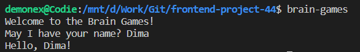
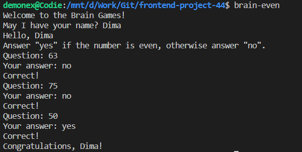
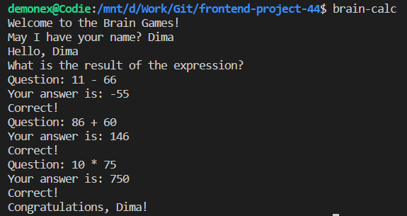
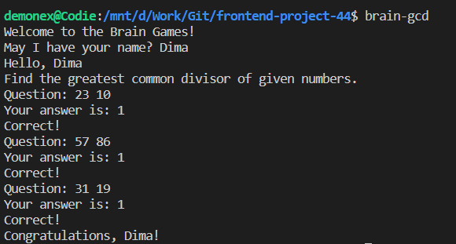
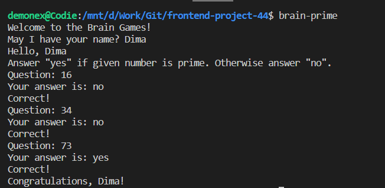

# Hexlet@Frontend project №1. "Brain-games"

## Description

- *A collection of 5 math games that you can play in the terminal*
- *You must answer 3 questions correctly in each game to win.*
- *Incorrect answer ends the game*

## How to start the project

- _**git clone URL-OF-REPO**_ to clone repo at your machine
- _**make install**_ to intall all dependencies

## How to play

- _**brain-games**_ to start test the programm

- _**brain-even**_ to run a game to determine the parity of a number (is number even or not)

- _**brain-calc**_ to run a game to calculate an expression from two numbers

- _**brain-gcd**_ to run a game to calculate the greatest common divisor of two numbers

- _**brain-prime**_ to run a game to determine if a number is prime

- _**brain-progression**_ to run a game to determine the missing number in progression
(/assets/brain-progression-image.png)

